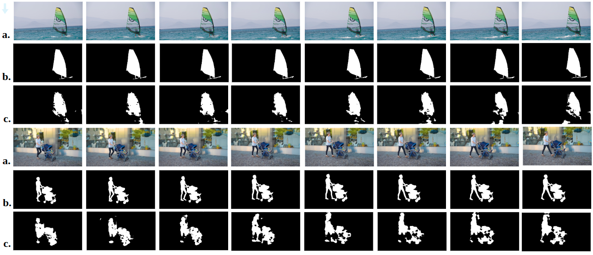
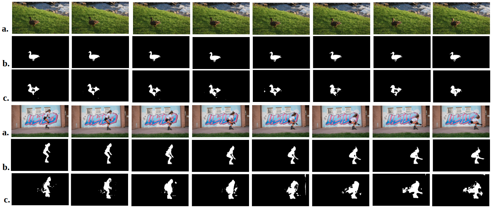

# β-MuliVariational AutoEncoder for Entangled Representation Learning in Video Frames

This code is the official implementation of the following paper:

&beta;-Multivariational Autoencoder (&beta;MVAE) for Entangled Representation Learning in Video Frames

## Exemplary result




These video sequences are from DAVIS16 dataset.(a.Image, b.Annotation, c.&beta;MVUnet)

## Install

To create the environment, follow these commands:

```
conda create -n bmvae python=3.8
conda activate bmvae
pip install -r requirements.txt
```

This code is developed and tested on Ubuntu OS 18.04.5.

## Predict

+ First, download the network weights from the [Google Drive Link.](https://drive.google.com/drive/folders/1RE_5KmpD3_SPUyp54ddLiPXCxMGDes24?usp=sharing) and put them on the **ckpts** folder. 
+ Run the following command for testing &beta;MVAE network:
```
python test_bmvae.py
```
+ Run this command for testing &beta;MVUnet network:
```
python test_bmvUnet.py
```


## Dependencies

+ [U-Net: Semantic segmentation with PyTorch](https://github.com/milesial/Pytorch-UNet)
+ Samples are from [DAVIS2016 dataset](https://davischallenge.org/index.html)
+ Training data are preprocessed sequences from [YouTube-VOS dataset](https://youtube-vos.org/)


## Cite

Please cite our work as:

[arXiv:2211.12627 (cs)](https://arxiv.org/abs/2211.12627)


## Contact
[Fatemeh Nokabadi](mailto:nourifatemeh1@gmail.com)


